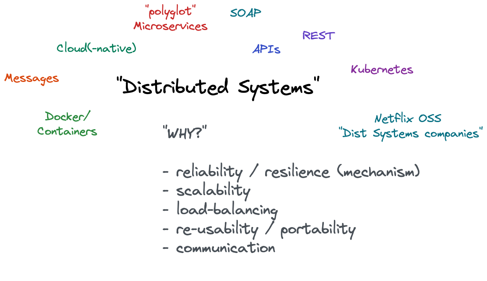
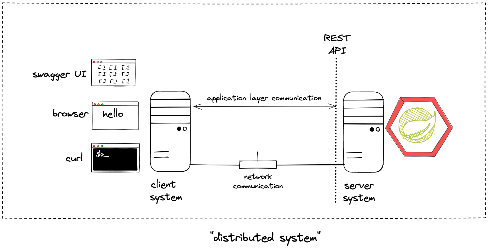
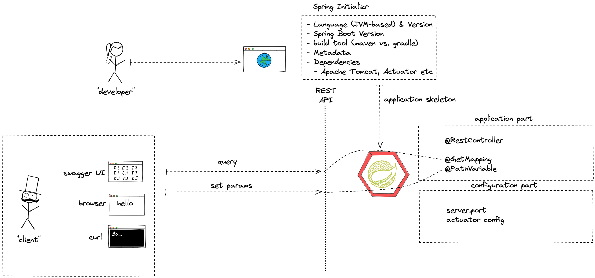
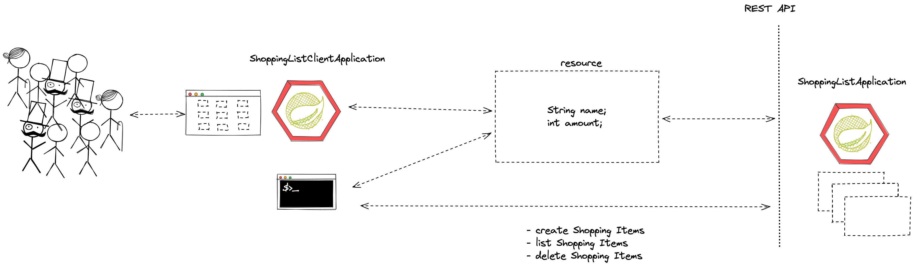
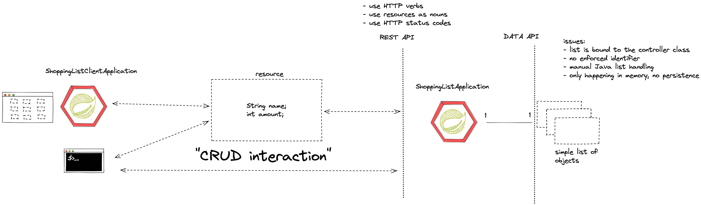
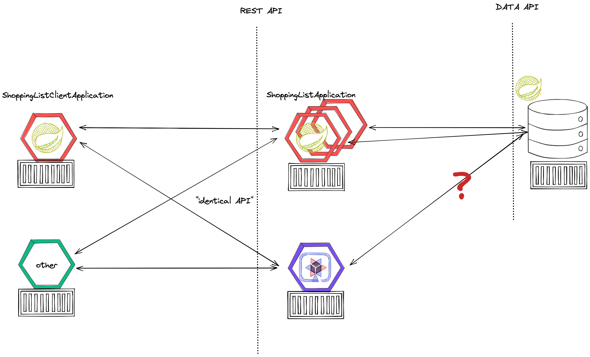
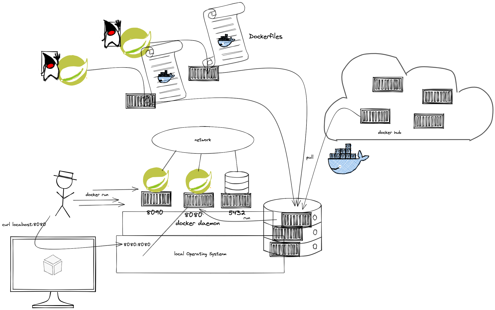

= Overview

[cloud-intro]

== (03/21) Module: Cloud Introduction (theory-block I)

=== Intro questions:

* Which technologies or what do you have in mind in general if you think about "distributed systems"?
* the "WHY" - Why would people use and implement a distributed systems architecture?

=== Content

* What is Cloud Computing? Encounters in everyday life and history
* Characteristic, advantages & challenges
* Terminology - public, private, hybrid, dedicated
* Abstraction layers - IaaS, PaaS, FaaS, SaaS
* Overview - Hypervisors, virtual machines, containers and orchestration
* Overview - Global cloud service providers (CSPs), technologies and corresponding offerings

=== Objectives and exercises
_The student is able to describe cloud computing in own words and list examples for offerings, topologies and technologies. Includes ability to differentiate between different abstraction layers and knowledge how those layers and according technologies interact with each other. No exercises in this module_

=== Links:

* https://landscape.cncf.io/
* https://csrc.nist.gov/publications/detail/sp/800-145/final

=== Review questions

* What modern, current technologies relate to the topic of distributed computing. List 3 and explain why.
* Describe 3 abstraction layers of cloud (incl. abbreviation) and list a technology example for each.
* What characteristics and features can I expect as a service consumer from the various layers.
* List pros and cons for cloud (generic) - X examples each

=== Lab tasks:

* Get a (public) git provider (github, gitlab, internal gitlab of HSE ...)
* Get a Java-compatible IDE (VS Code, Intellij Idea, gitpod, Eclipse ...)
* Get a docker id
* Recommended: Local Docker/Container environment (Docker for Windows/Mac, Rancher Desktop)

== (03/28) Module: Spring Boot and REST API Intro

== Module: Spring Boot Introduction

* Background: Spring Framework - History & components
* Spring <- -> Spring Boot
* Spring Initializr (start.spring.io) & starter dependencies
* Basic project structure (folders, configuration ..)
* "Hello, World!" example explained
* Using Actuator

=== Objectives
_The student is able to build and configure an own Spring Boot application from scratch with the IDE of choice. The exercise is to build an own "Hello, World!" application that exposes various - endpoints and is able to execute CRUD operations on the state of the application. Optional: Add logging and testing, configure Actuator._

=== Links:

* https://spring.io/
* https://spring.io/projects
* https://spring.io/tools
* https://start.spring.io/
* https://spring.io/guides/gs/rest-service/
* https://springdoc.org/
* https://www.baeldung.com/spring-rest-openapi-documentation
* https://www.baeldung.com/spring-pathvariable

=== Lab tasks:

* Build your own Spring Boot application starting at the Spring Initializr (start.spring.io)
* Add the following dependencies: Spring Web, Actuator, DevTools
* Run the microservice and test the endpoint /actuator/health and /actuator/info
* Annotate the Microservice with @RestController and implement a "Hello, World!" method, which responds to an HTTP GET request.
* Add some basic "functionality" to make the service react to HTTP GET, POST calls (e.g. modify an internal list). Optional: PUT and DELETE
* Change the server port to 8090
* Add the Swagger UI as described in the Baeldung tutorial
* Add an echo endpoint that returns a given parameter using the @PathVariable annotation

== (04/03) Module: Spring Boot Recap and REST

* Synchronous communication
* HTTP and REST
* Verbs, Resources, Nouns
* Evolution, Richardson Maturity Model
* CRUD Operations
* Building a REST API with Spring (Boot)
* Building a data model with REST

=== Links:

* https://restfulapi.net/idempotent-rest-apis/
* https://restfulapi.net/richardson-maturity-model/
* https://en.wikipedia.org/wiki/List_of_HTTP_status_codes

=== Student Question:

* Identification of an item (or a resource on general on the server side)? What is the identifier?
* Which client do I use if I want to do anything else than a GET call? Clients: Postman, curl
* Feedback to client for successful or non-successful execution?
** HTTP Status codes
** Return type: Return created or modified object, nothing if deleted successfully
* How does the code determine which status code to respond with

=== Lab tasks:

* Build your own data model. Start with a simple Java class (e.g. Shopping Item, Todolist Item, Person Info)
* Build a - API using a verbs and nouns to
** Create item entries
** List item entries
** Delete item entries
** Update item entries
* Use JSON as exchange mechanism

== (04/11) Module: REST Recap, Persistence and UI

* Repeat REST API concepts & HTTP status codes
* Spring Data
* Concept of entities and repositories
* JPA, SQL and JDBC basics
* H2 as in-memory database backend

=== Objectives and exercises
_The student is able to build a Spring Boot application (or extend an existing one) with Spring Data configuration. The exercise is to create an application, which performs CRUD operations on a database backend. The database can either be in-memory (H2) or a (containerized) PostgreSQL (soon :-))._

=== Links

* https://spring.io/projects/spring-data
* https://spring.io/guides/gs/accessing-data-jpa/
* https://www.baeldung.com/spring-data-derived-queries
* https://docs.spring.io/spring-boot/docs/1.0.x/reference/html/howto-database-initialization.html

=== Student Questions:

* How can you return different HTTP status codes depending on the result of your invocation?

=== Lab tasks:

* Add Sping Data JPA to your application, use H2 as database driver/implementation in the first place
* Extend the data object with @Entity annotation AND define an id
* Build a repository interface based on Crud/JPARepository
* Autowire the repository to your application / Controller class
* Invoke "database actions"

Links:
* https://spring.io/guides/gs/accessing-data-jpa/
* https://www.baeldung.com/spring-boot-h2-database

== (04/11) Lookout: Idea/Big picture of lab task

* Provide interchangeable frontend and backend components for UI and business logic
* Any frontend needs to be able to talk with any backend
* Any backend needs to expose the same API and interact with the same database

== (04/18) No lecture (Easter Monday)

== (04/25) Introduction to containers and docker

* What are containers and how do they work
* Containers vs. VMs 
* History of containers and rise of Docker
* Docker concepts: daemon, hub, dockerfile, CLI
* Running containers with various options

=== Objectives and exercises
_The student understands the concepts and use cases of container technology and is able to describe them. The first exercise is to pull sample images from an image registry (e.g. Docker Hub) and interact with them (run, expose port, execute shell, cleanup etc). After that the student can show how to build a custom image via Dockerfile and push it to a registry for others to access. Complete the exercises handed out via URL._

=== Links

* https://labs.play-with-docker.com/
* https://katacoda.com/
* https://opencontainers.org/
* https://www.docker.com/products/docker-desktop
* https://www.youtube.com/watch?v=fqMOX6JJhGo

== (05/02) Alternatives to REST - Guest lecturer Lars

=== Talk abstract
_REST is the most popular web API technology used these days. It is well supported by programming languages, frameworks and all kind of monitoring tools as well as understood by many developers. It is therefore often the first choice when having to implement a web API for any kind of backend. But there are limitations and use cases where - API’s do not fit that well. Luckily, there are a few interesting alternatives available these days. GraphQL is one such alternative so are gRPC and RSocket. In this talk I will introduce these technologies, explain their pros and cons compared to -, talk about their maturity and how they are supported by Spring and Spring Boot. I will show code examples and a live demo._

=== Objectives and exercises
_The student understands there are more communication options between two peers than only REST which we have covered before. It's not necessary to know implementation details, but at least awareness of their existence._

== (05/09) Lecture cancelled due to Covid

== (05/16) Lab specification and container revision

* https://github.com/maeddes/hse-2022-summer/blob/main/LAB.adoc

* Usage of docker from local machine, play-with-docker labs and gitpod
* Creating own container images vs. re-using from docker hub (remote container registry)
* Difference between container image and container
* Creating docker networks and attaching running containers
* Running containers with various options
* Push/pull

=== Objectives and exercises
_The student understands the concepts and use cases of container technology and is able to describe them. The student is able to either build own container images or pull images from docker hub and configure them according to the given documentation. The student is able to connect mulitple running containers over a docker network._

== (05/23) Container Images & Build Options

* Difference and relation between container and container images
* Concepts of image layers
* "docker commit"
* History of Dockerfile. Initial, multi-stage & BuildKit
* Building container for Java apps
* Using Jib, Cloud-Native Buildpacks and Paketo

=== Objectives and exercises
_The student understands the relation between container image and container, how to instantiate a container from an image and how to commit to a new image from an existing container. The exercise is to build the previous Spring Boot application and put it into a container image using various options, e.g. different Dockerfile options, Google JIB, CND, Paketo and more ...? The student is aware and able to describe on a high-level what the different fundamentals of the various approaches are and is able to list advantages and disadvantages._

=== Links

* https://docs.docker.com/engine/reference/builder/
* https://buildpacks.io/
* https://paketo.io/
* https://github.com/maeddes/options-galore-container-build/blob/main/walkthrough.adoc
* https://github.com/GoogleContainerTools/jib

=== Review questions

* List 3 different options to build a container image
* Explain docker build vs docker commit 
* List 2 evolution steps of the Dockerfile and provide 1 improvement for each step 
* Explain or list 1 advantage&disadvantage comparing JIB and Paketo/CNB to original Dockerfiles
* How is a container image build up internally?
* Which are criterias you can think that make image building "better"

== (05/30) Cloud-native software development & Microservices (theory-block II)

* CAP Theorem
* Conway's Law
* Fallacies of distributed computing
* Domain-Driven Design basics
* 12-factor application
* Evolution of applications and deployments: Monolithic -> Service-Oriented Architecture -> Microservices
* Introduction to serverless and FaaS terminology

=== Objectives and exercises
_The student knows about the evolution of distributed systems and the drivers towards state-of-the-art implementation and deployment. She/he can explain the underlying concepts and theories and put it into practical context. No dedicated exercises for this module. Recap of basics: Spring Boot, Docker, configuration and persistence._

=== Links

* https://en.wikipedia.org/wiki/Fallacies_of_distributed_computing
* https://12factor.net/

=== Review questions

* Describe the concept of CAP/Conway/.. in your own words
* Identify aspects of 12-factor in the technologies we have covered so far (mostly Spring Boot & Docker)
* Explain why the 12-factor idea is helpful for cloud-based applications
* Describe the criteria of a microservice
* List advantages/disadvantages microservices <-> monoliths